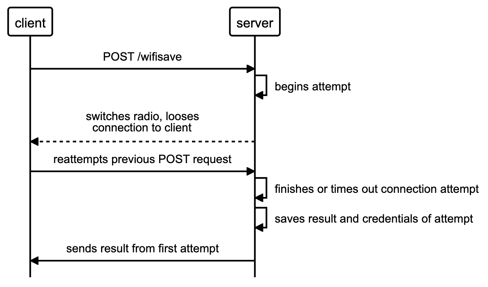

# What is this

This is a captive portal to allow a user to upload wifi network credentials to an ESP8266/ESP32 microcontroller. The microcontroller creates a wireless network on boot, which a user can connect to and enter network details.

This is probably the simplest, most intuitive method possible for a layperson to connect an ESP8266 project to their local WiFi. All they need to do is connect to the ESP's wireless network, press "sign in to network", and enter the ssid and password. I want this to be something my Gran can do.

This project is intended to function as a library, being something that can be dropped into any ESP project. It started off as something that I can shove [Sinric Pro](https://sinric.pro/index.html) into for multiple smart-home projects I want to make. There's another project though, a Medicine Alarm Clock, that will likely need to talk to a server and will need internet connectivity to do so. It will recieve the network details through an accompanying app, so interacting with the portal through API calls has become an important requirement. I think this might be similar to how chromecast devices are connected to the internet.

# Test Portal
There is a Ruby Test Server for making changes to config.html. Once the html file is known to work, the server-side code is implemented on the microcontroller in C++.
## running the test server
to run the test server:
```bash
cd "ruby server test"
rackup -o 0.0.0.0
```
find your computers ip address (mine is 192.168.0.229)

on your phone, go to `{ip}:9292`

i.e. on my phone right now, I have `http://192.168.0.229:9292`

## running the real server

Install [PlatformIO](https://platformio.org/) for VSCode, hit upload, build the filesytem image, upload the filesystem image, and you should see the device in the WiFi networks of your phone or computer.

# Theory of Operation

The ESP microcontroller opens an Access Point on boot. When a client connects to this network, they are prompted to sign in to the network. The client requests the captive portal, and is served a static page from the flash file system (LittleFS). The client fills in the credentials (or changes any of the advanced settings), and makes a post request to the microcontroller using the fetch API. The server process the request, and responds with a json object, and the webpage adjusts itself accordingly.

The webpage currently makes a fetch request for the server details (i.e. device name), however I would like to replace that with templating or something similar, as there is currently a noticable delay between the page loading and certain elements being filled.

## Fetch is totally fetch

There are a couple of advantages to using fetch to modify a static webpage, one of which being that it should almost work out-of-box with a hyperthetical mobile app that might be needed for my Medicine Alarm Clock.

The biggest one, though, is that it allows me to mitigate a very specific server-side bug: When the device tries to connect with bad credentials, it will at some point disconnect from the station or switch channel to the one the network is on, and then try to reconnect. This momentary drop in signal will cause the fetch request to fail, even though the connection is still there. Needless to say, it was a very stressfull Tuesday figuring all this out. Using fetch requests gives me a way handling this non-response in a user-friendly manner.

Firstly, the server will explicitly stop the connection process after the timeout is reached, ensuring this issue only exists for around 30 seconds at a most. On the client side, if the server drops, it will send out a second fetch request that the server queues behind the first (which is unlikely to be completed). Once the first connection attempt is complete, it saves the result as well as the ssid and password. If the credentials from the second attempt match those from the previous attempt (in this instance they will), it will send the result from the previous attempt.

It's also presumed that a failure to connect within the timeout is due to the password being wrong (this has been mostly true based on observations). The page catches the failed fetch request and displays a 'wrong password' message.


## Network List

The list of network SSIDs is collected with a fetch request from the portal.

I would like if the webpage updated the wifi networks every 10 or so seconds. To do this, the webpage should make periodic GET requests to the server, that will then serve the wifi networks. A JS function will fill out the page elements.

To keep the list current, the wifiscan should be performed every 10 seconds, and should only wipe the old network list after the scan is complete (incase the client requests mid-scan).

## Server Flags

If a user submits a wrong password, the wrong_password flag should be raised, and a message should be displayed on the screen informing the user of their erronous assertion. In this instance, the page should redirect to a url containing `wrong_pwd=true` in the url. The when the page loads, it will scan the url for params, it adjust the page content accordingly.

## Diagrams

```
# esp should start network scan immediately
# if it can't connect to a network, and should
# rescan every 30 seconds until it is connected
esp->esp: "starts the network scan"
client->esp: "get '/config'"
esp->esp: "starts the network scan"
esp->client: "serves config.html,
config.css, config.js"
client->esp: "get '/network_list'"
esp->client: "responds with 'not ready'"
client->esp: "get '/network_list'"
esp->client: "serves networks.json"
```

### wifisave fetch requests 

```
alias client="client"
alias server="server"

client->server: "POST /wifisave"
server->server: "begins attempt"
server-->client: "switches radio, looses
  connection to client"
client->server: "reattempts previous POST request"
server->server: "finishes or times out connection attempt"
server->server: "saves result and credentials of attempt"
server->client: "sends result from first attempt"
```
### Saving Credentials Flow

Below is the flowchart for saving a POSTed ssid and password. There could eventually be a check for if the wifi ssid has already been saved, so if the user enters a wrong (or no) password for a given network, it will try to connect using the stored password instead. This gives the user freedom to select a prefered network (i.e. if they have multiple routers at home, and the device has connected to the one with poor connection). This could of course be reduntant by having the device pick strongest availlable network stored, and re-assessing networks if the connection drops. I think it still could be nice to have though.
```https://playground.diagram.codes/d/flowchart
"WiFi details are POSTed"
IF "do they work?"
 "save new credentials"
ELSE
 IF "ssid is stored
 in memory?"
 "use stored password"
  IF "does it work?"
   "save credentials"
  ELSE
   "send 'bad password' message"
  END IF
 ELSE
    "send 'bad password' message"
 END IF
END IF
```

### Boot Sequence

```
alias main = "main.cpp"
alias webserver = "webserver"
alias info = "webserverInfo"
alias helpers = "wifiHelpers"

main=>webserver: "setupWebServer()"
webserver->info: "loadServerInfo()"
webserver->helpers: "scan networks"
webserver->info: "getDeviceName()"
info-->webserver: "returns stored device name"
# the softAP stuff should be moved into wifiHelpers
webserver->webserver: "start softAP"
webserver->helpers: "connectOnBoot()"
helpers->info: "getSavedNetworks()"
info-->helpers: "returns list of networks"
helpers->helpers: "checks if any of the networks are available"
# assuming it found one:
helpers->info: "getPassword(ssid)"
info-->helpers: "returns password"
helpers->helpers: "attempts connection"

# inside main()

main->webserver: "handleWebServer()"
webserver->helpers: "getConnectionStatus()"
# this instead be WiFi.status()
webserver->helpers: "scanNetworks()"
helpers->helpers: "checks time since last scan"
```

# Feature Wishlist

* when connected to a network, the network is removed from the Available Networks list and placed above it.
* a button to disconnect from the network you're connected to
* signal strength indicators
* the settings are hidden, and there's a buttont at the bottom of the page that will draw the settings up over the main page
* multiple saved networks: maybe if saved networks is full, the user sees a pop-up asking which networks to delete?
* have the networks streamed periodically to the server using server-sent events

* have platformio minify the html file (and possibly combine html, css and javascript) before uploading filesystem